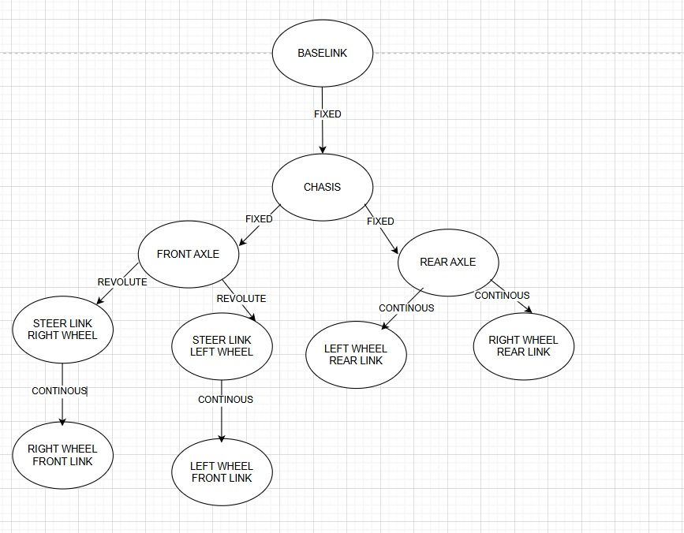
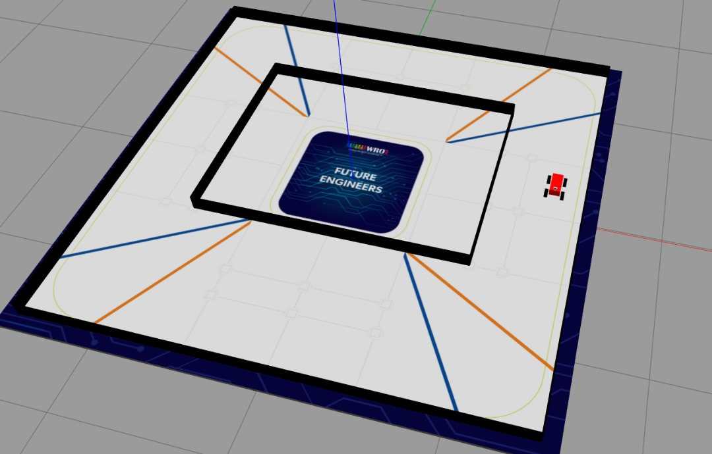
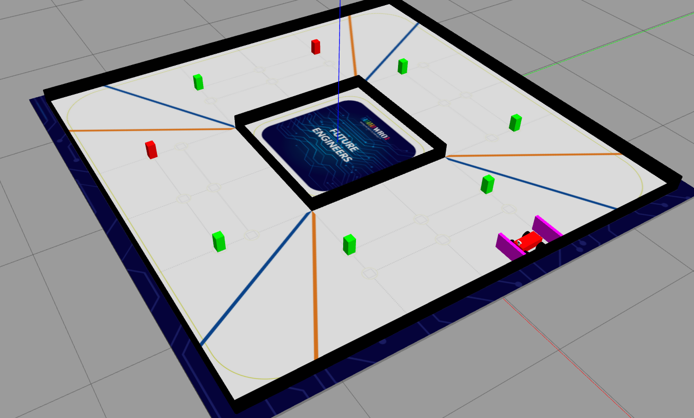
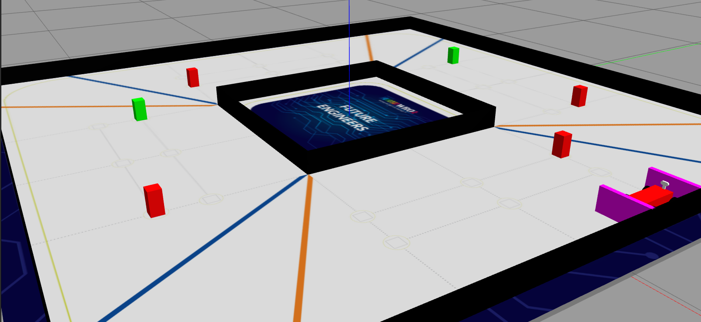

# Technical Documentation

## Introduction

### Team
* Coach: 
    * **Engr Dr Balogun Wasiu Adebayo**: A senior lecturer at the Lagos State University of Science and Technology whose research interests lie at the intersection of Mechatronics, Artificial Intelligence, and Automation, focusing on enhancing distributed systems control, precision engineering, and automotive electronics. He is particularly interested in developing intelligent grading systems, optimizing robust control mechanisms, and applying machine vision in automotive applications. His work also explores advancements in robust decentralized control, leveraging optimization techniques.
* Team Members: 
    * **Ohieku Eneji Peacemaker**: A 300L engineering student from the Lagos State University of Science and Technology, Department Of Mechatronics Engineering. A very passionate problem solver involving in activities such as Competitive Programming (Math/Coding Sports), Embedded Systems Engineering & Robotics, CAD modeling (Mechanical and Electronics Designs) and Machine Learning/Deep Learning. He has participated and won Hackathons, assisted researches, Built Robots, Embedded Systems and Programs.

    * **Agbede Collins Theophilus**: He is a 300-level Electrical and Electronics Engineering student at Lagos State University of Science and Technology with a strong interest in mathematics and robotics. He is passionate about applying mathematical principles to solve real-world engineering problems, particularly in control systems, automation, and intelligent hardware design. Collins is actively exploring robotics projects and sharpening his skills in areas such as kinematics, circuit design, and algorithm development. His goal is to contribute to innovative solutions at the intersection of engineering, mathematics, and technology.

### Project Overview
In the light of proffering a solution to the Self driving Car Challenge FE 2025 we proposed the development of a virtual robotic simulation environment. This has a virtual robot with kinematic properties as an ackermann steer drive (As described in the FE Rules Document), The Mat, Walls and Objects also according exact dimension specified, Randomness such as coin tosses, card selection/shuffling and roll of a die. All in simulation helping us test ideas and control software in a virtual environment.

***

## Core Technology Used
We will be dicussing the technologies we in the development of this project.
* **Robot Operating System (ROS)**: A powerful set of software libraries and tools for building robot applications, providing drivers, algorithms, and developer tools for robotics projects. Usually run on ubuntu ros aids the development of robots.
* **Gazebo Simulation Software**: Gazebo brings a fresh approach to simulation with a complete toolbox of development libraries and cloud services to make simulation easy. Iterate fast on your new physical designs in realistic environments with high fidelity sensors streams. Test control strategies in safety, and take advantage of simulation in continuous integration tests.
* **Unified Robot Description Format (URDF)**: it is an XML format for representing a robot model or physical structures.URDF is commonly used in Robot Operating System (ROS) tools such as rviz (Ros Visualization tool) and Gazebo simulator. The model consists of links and joints motion.
* **Xacro (XML Macro)**: is a macro language for XML documents, often used in robotics and simulation environments like ROS (Robot Operating System). It simplifies complex XML files by allowing users to define reusable macros, generate robot descriptions, and configurations. Xacro files are typically converted to URDF (Unified Robot Description Format) or other formats for use in simulations or robots.
* **OpenCV (Open Source Computer Vision Library)**: is a widely-used library for computer vision and image processing, providing tools for tasks like image and video processing, object detection, facial recognition, tracking, and machine learning. It's commonly used in applications such as robotics, surveillance, self-driving cars, medical imaging, and augmented reality, with its open-source nature making it accessible and customizable.


***

## System Architecture
In this section we will be describing the entire system by breaking them down into small understable units, giving an overview and the relationship between those units.
* **Robot Model Description**: The robot model was created by using URDF to describe kinematic Structure and Appearance. Each part of the robot is described as a link having visual, collision and inertial properties. Every link has a relationship to another link in a tree structure called joints which were either fixed, revolute, continuous, prismatic etc.  
  
Then and overview of its structure as described in the URDF code whose dimensions is under the constraints of the WRO FE RULES.   
The robot is spawned in the virtual world at a random subsection of the straight road in the open challenge configuration and the robot spawns in the parking area in the obstacle challenge configuration. both have their direction randomly selected.
* **World Model Description**: This aspects involves everything in the simulation aside the robot itself such as the mat/ground-plane, the walls, the green/red blocks and the parking space. The World description is divided into two parts; the open challenge and obstacle challenge. Both are run independently. We will describe them seperately.
    * **Open World**: This basically includes the mat. The mat was modelled in blender as a 3.2m by 3.2m by 0.005m (according to specification) and then used in the URDF. The Outer walls are fixed and the inner walls each can be extended or left undisturbed by a random event (coin toss). The robot is then spawned at a random position in the starting section and the driving direction also random. Here are some random configuration of the open world generated by the simulation environment.  
    
    
    
    

    * **Obstacle World**: This uses the same decriptions in the open challenge; Except that the walls arent extented at all. The addition of colored blocks having a floating joint to the floor (6 DOF joint) and the parking lot walls. The positions and configuration of the blocks which is to be determined by random cards shuffling and selection was modelled and simulated using a custom encoding method. We decided to number the positions from 1-6 and each position could either have 1, 2 or 3; Where 0 means no block present, 1 means a red block and 2 means a green block. making it possible to model and represent it in simulation.  
    Transforming this:  
      
    To this using a custom encoding format:  
       
    Here are some random configuration of the obstacle world generated by the simulation environment.  
    
    
    
     
    
    * **Gazebo**: Our physical simulation run in gazebo. We make use of it as physical properties in real life such as momentum, gravity, collisions, friction, inertia etc are properly and accurately computed making use of the Open Dynamics Engine (ODE). A gazebo plugin (gazebo_ros2_control) helps us to apply forces to joint (command_interfaces) and get feedback as sensory data (state_interfaces (position or velocity)). A virtual camera was also used in gazebo with the aid of a camera plugin it help us see what the robot sees in gazebo and stream that info to our Control Software to drive the robot in the environment.
    * **Ros2 Control (Ackermann Steering Controller)**: The ros2 control is a framework that allows us to write controllers that are independent of what hardware or sensor they work with. This feature helps us to be able to swap out hardware/drivers without changing the controller. Also allows us to use the exact same algorithm on either a virtual robot or an real robot.  
    For this competition since we are expected to use a steer drive and one actuator for the rear wheels, The Ackermann steer mechanism and the differential gear mechanism is a perfect fit for the job as it very similar to a car. The mechanism can be contructed much easier than modelling it in simulation. We make use of Formulas to be able to perform odometry (use of data from motion sensors to estimate change in position over time) of both the physical robot and the virtual robot. The kinematics Formulas are used for the Virtual Robot. The biggest Advantage of this approach is that it reduces skidding/slipping of the wheels and improves accuracy of odometry estimate.  
    The Ackermann Mechanism  
    
    
    
    * **Navigation Software**: This tells the controllers what action to take. The decisions of this Software is based on the sensory data such as camera feed, accelerometer and gyroscopes (IMU data) and lidars. The navigation software is divided into two the open world and obstacle world navigation. In the open world navigation we get camera feed from a virtual camera in gazebo and then use opencv to analyze the image and make decisions. The decisions are then sent to the controller which effectively controls the robot and drives it around. For the open challenge its just as simple as detecting a corner and turning; Then count the number of turns to know when the robot has completed 3 laps and stop it. For the Obstacle Challenge its a more complex scenerio that needs high levels of reliablity hence the need for the optimal design of the robot (placement of camera and angle, lighting etc) before editing the virtual robot to be an exact replica of the physical robot (eg mass, dimensions etc) then the Navigation software can be written.  
    [watch the autonomous driving of the robot](.)

***

## Running the Simulation
In this section we will lay out the steps and what you need to run our simulation program.

1. Make sure you have the **Ubuntu** linux operating system <https://ubuntu.com/tutorials/install-ubuntu-desktop>. If using Windows you can install WSL (windows Subsystem For linux) and install ubuntu using **WSL2** <https://learn.microsoft.com/en-us/windows/wsl/install> *use Ubuntu-22.04 to avoid issues others could work but untested*.
2. Install ROS2 on your ubuntu <https://docs.ros.org/en/humble/Installation/Ubuntu-Install-Debs.html>.
3. Install Gazebo using this command.
```bash
user@user:~$ curl -sSL http://get.gazebosim.org | sh
```
4. Install Ros2 Control.
```bash
user@user:~$ sudo apt install ros-humble-ros2-control ros-humble-ros2-controllers
```
5. Setup your ros workspace and build with colcon.
```bash
user@user:~$ mkdir ros_ws
user@user:~$ cd ros_ws
user@user:~/ros_ws$ rosdep install -i --from-path src --rosdistro humble -y
user@user:~/ros_ws$ mkdir src
user@user:~/ros_ws$ colcon build
user@user:~/ros_ws$ echo "source install/setup.bash" > ~/.bashrc
user@user:~/ros_ws$ source ~/.bashrc
```
6. Git clone this repo an copy the `wro_robosim` folder in the `src` folder of this repo and paste it in your ros workspace `src` folder.
```bash
user@user:~/ros_ws$ cd ..
user@user:~$ git clone https://github.com/EnejiOhieku/World_Robot_Olympiad_mathbot
user@user:~$ cp -r World_Robot_Olympiad_mathbot/src/wro_robosim ros_ws/src/wro_robosim
```
7. Change directory to your ros workspace and build the `wro_robosim` package with this command.
```bash
user@user:~$ cd ros_ws
user@user:~/ros_ws$ colcon build --packages-select wro_robosim
```
8. Run the launch file for either the open challenge or the obstacle challenge.
```bash
user@user:~$ ros2 launch wro_robosim open_world.launch.py
```
```bash
user@user:~$ ros2 launch wro_robosim obstacle_world.launch.py
```
9. To drive manually on your keyboard run this in a separate terminal. *Note: the terminal has to be active for your to use you keyboaaard to send commands.*
```bash
user@user:~$ ros2 run teleop_twist_keyboard teleop_twist_keyboard -r /cmd_vel:=/ak_controller/reference_unstamped
```
10. To start up the navigation software and automatic driving for the open world in a new terminal.
```bash
user@user:~$ ros2 launch wro_robosim open_nav.launch.py
```

